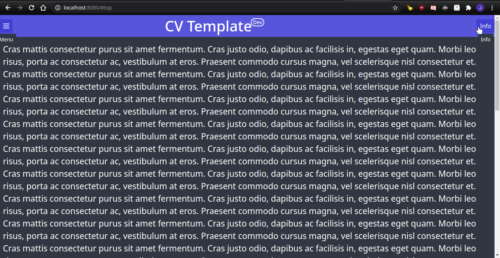

# Simple CV Template basic example

# Use

- Install Nim https://nim-lang.org/install.html
- Install Karax `nimble install karax`.
- Compile `nim js index.nim`.
- Open `app.html` that links `index.js`.
